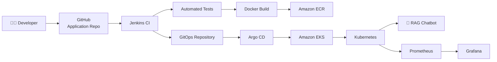
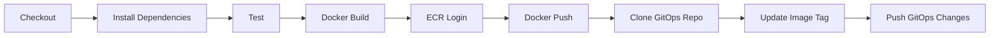

# 🤖 RAG Chatbot — Gemini + Streamlit + CI/CD + GitOps

<p align="center">


</p>

<p align="center">

### 🚀 An AI-powered RAG chatbot taken from local development to a complete cloud-native CI/CD + GitOps deployment workflow.

</p>

---

## 📌 Project at a Glance

This project started as a **Python + Streamlit RAG chatbot powered by Google Gemini** and was extended into a complete DevOps / Cloud-Native workflow.

The application was:

* 🧠 Developed as a Retrieval-Augmented Generation application
* 🖥️ Served through Streamlit
* 🐳 Containerized using Docker
* 🔄 Automatically built and tested using Jenkins
* 📦 Published to Amazon ECR
* 🌱 Integrated with a separate GitOps repository
* ☸️ Deployed to Amazon EKS through Argo CD
* 📊 Monitored using Prometheus and Grafana

The infrastructure was successfully deployed and validated on AWS and was then intentionally torn down after testing to avoid unnecessary ongoing AWS charges.

> **This repository contains the application and CI portion of the project. Kubernetes deployment manifests and GitOps configuration are maintained separately.**

---

# 🧭 Table of Contents

* [Architecture](#-architecture)
* [Application Flow](#-application-flow)
* [Features](#-features)
* [Technology Stack](#-technology-stack)
* [Repository Structure](#-repository-structure)
* [How the RAG Application Works](#-how-the-rag-application-works)
* [Local Development](#-local-development)
* [Environment Variables](#-environment-variables)
* [Testing](#-testing)
* [Docker](#-docker)
* [CI Pipeline](#-ci-pipeline)
* [Amazon ECR](#-amazon-ecr)
* [GitOps Integration](#-gitops-integration)
* [Why Two Git Repositories](#-why-two-git-repositories)
* [Security](#-security)
* [Troubleshooting](#-troubleshooting)
* [Successful Deployment Evidence](#-successful-deployment-evidence)
* [Interview Explanation](#-interview-explanation)
* [Future Improvements](#-future-improvements)

---

# 🏗️ Architecture

The complete project follows this flow:



### 🔑 Important Design Decision

Jenkins is responsible for **CI and image publishing**.

Argo CD is responsible for **CD and Kubernetes reconciliation**.

Jenkins does **not** directly execute:

```text
kubectl apply
```

Instead:

```text
Code
 ↓
Jenkins
 ↓
Docker Image
 ↓
Amazon ECR
 ↓
GitOps Repository
 ↓
Argo CD
 ↓
EKS
```

This separation is one of the main architectural concepts demonstrated by this project.

---

# 🔄 Application Flow

At a high level:

```text
User
  │
  ▼
Streamlit UI
  │
  ▼
Application Logic
  │
  ▼
Retrieval / Context Processing
  │
  ▼
Google Gemini
  │
  ▼
Generated Response
```

The application provides a user-friendly interface while the CI/CD layer handles automated software delivery.

---

# ✨ Features

## 🧠 AI / Application

* Retrieval-Augmented Generation workflow
* Google Gemini integration
* Streamlit-based user interface
* Environment-based API configuration
* Python-based application

## 🧪 Quality

* Automated Python tests
* Dependency installation inside Jenkins
* Automated test execution before Docker image creation

## 🐳 Containerization

* Dockerfile included
* Reproducible application environment
* Versioned container images
* Images published to Amazon ECR

## ⚙️ CI/CD

* Jenkins pipeline
* Automated checkout
* Dependency installation
* Automated testing
* Docker image build
* ECR authentication
* ECR image push
* GitOps repository update

## ☁️ Cloud-Native

* Amazon ECR
* Amazon EKS
* Kubernetes
* Argo CD
* Prometheus
* Grafana

---

# 🛠️ Technology Stack

| Layer              | Technology    |
| ------------------ | ------------- |
| Language           | Python        |
| UI                 | Streamlit     |
| LLM                | Google Gemini |
| Version Control    | Git + GitHub  |
| CI                 | Jenkins       |
| Containerization   | Docker        |
| Container Registry | Amazon ECR    |
| Cloud              | AWS           |
| Kubernetes         | Amazon EKS    |
| CD / GitOps        | Argo CD       |
| Monitoring         | Prometheus    |
| Visualization      | Grafana       |

---

# 📁 Repository Structure

```text
rag-chatbot-gemini/
│
├── app.py
├── app1.py
│
├── requirements.txt
│
├── Dockerfile
├── .dockerignore
├── .gitignore
├── .env
│
├── Jenkinsfile
│
├── tests/
│   └── test_app.py
│
└── README.md
```

### Important Files

| File                | Purpose                                  |
| ------------------- | ---------------------------------------- |
| `app.py`            | Main application                         |
| `app1.py`           | Experimental/simple application code     |
| `requirements.txt`  | Python dependencies                      |
| `Dockerfile`        | Container image definition               |
| `Jenkinsfile`       | Jenkins CI pipeline                      |
| `tests/test_app.py` | Automated tests                          |
| `.env`              | Local environment configuration          |
| `.dockerignore`     | Files excluded from Docker build context |
| `.gitignore`        | Files excluded from Git                  |

> **Deployment target:** `app.py`

---

# 🧠 How the RAG Application Works

The application follows the general Retrieval-Augmented Generation concept:

```text
User Question
      │
      ▼
Retrieve Relevant Context
      │
      ▼
Combine Question + Context
      │
      ▼
Google Gemini
      │
      ▼
Generated Answer
```

Instead of relying only on the model's general knowledge, RAG applications can provide relevant context to the model before generating the response.

This helps build applications that are more grounded in the information supplied to the system.

---

# 💻 Local Development

## 1️⃣ Clone the repository

```bash
git clone https://github.com/adityarana021/rag-chatbot-gemini.git

cd rag-chatbot-gemini
```

## 2️⃣ Create a virtual environment

### Windows

```bash
python -m venv venv

venv\Scripts\activate
```

### Linux / macOS

```bash
python3 -m venv venv

source venv/bin/activate
```

---

## 3️⃣ Install dependencies

```bash
pip install -r requirements.txt
```

---

## 4️⃣ Configure environment variables

Create a local `.env` file.

Example:

```env
GEMINI_API_KEY=your_api_key_here
```

> ⚠️ Never commit the real API key to GitHub.

---

## 5️⃣ Start Streamlit

```bash
streamlit run app.py
```

The application should become available through the Streamlit local URL displayed in the terminal.

---

# 🔐 Environment Variables

The application uses environment variables for sensitive configuration.

Example:

```env
GEMINI_API_KEY=<your-secret-key>
```

### ❌ Never do this

```python
GEMINI_API_KEY = "actual-secret-key"
```

### ✅ Prefer

```text
Environment Variable
        ↓
Application
        ↓
Gemini API
```

The `.env` file is intended for local development and should remain excluded from Git.

---

# 🧪 Testing

Tests are maintained under:

```text
tests/test_app.py
```

Run them locally using:

```bash
python -m pytest -v
```

The Jenkins pipeline executes the same test suite automatically.

---

# 🐳 Docker

The application can be packaged into a Docker image so that the same application environment can be used consistently across development and deployment environments.

## Build

```bash
docker build -t rag-chatbot .
```

## Run

```bash
docker run -p 8501:8501 \
  -e GEMINI_API_KEY="your-api-key" \
  rag-chatbot
```

The application listens on Streamlit's default port:

```text
8501
```

---

# 🔄 CI Pipeline

The Jenkins pipeline is defined in:

```text
Jenkinsfile
```

The pipeline follows:



---

# 🧩 Jenkins Stages

## 1. Checkout

Jenkins checks out the application source code.

```text
GitHub
   ↓
Jenkins Workspace
```

---

## 2. Install Dependencies

Jenkins creates a Python virtual environment and installs:

```text
requirements.txt
```

---

## 3. Test

Jenkins runs:

```bash
python -m pytest -v
```

If the tests fail, the pipeline stops.

This prevents a broken application from reaching the container build stage.

---

## 4. Docker Build

Jenkins builds the application image.

Images are versioned using the Jenkins build number:

```text
build-1
build-2
build-3
...
build-8
```

This gives every successful build a unique image tag.

---

## 5. ECR Login

Jenkins authenticates Docker with Amazon ECR using the AWS identity attached to the Jenkins EC2 instance.

This avoids storing long-lived AWS access keys directly inside Jenkins.

---

## 6. Docker Push

The resulting image is pushed to:

```text
Amazon ECR
```

Example:

```text
rag-chatbot:build-8
```

---

## 7. Clone GitOps Repository

Jenkins then checks out the separate GitOps repository:

```text
rag-chatbot-gitops
```

---

## 8. Update Image Tag

Jenkins modifies:

```text
app/deployment.yaml
```

and updates the container image reference.

Example:

```yaml
image: <ECR_REGISTRY>/rag-chatbot:build-8
```

---

## 9. Push GitOps Changes

Jenkins commits the new image version:

```text
Update image to build-8
```

and pushes the change to GitHub.

At this point Jenkins' responsibility ends.

---

# 🌱 GitOps Integration

The most important concept in the delivery architecture is:

> **Jenkins updates Git. Argo CD updates Kubernetes.**

```text
                    CI
                     │
Developer → Jenkins ─┼──→ ECR
                     │
                     └──→ GitOps Repository
                                  │
                                  ▼
                              Argo CD
                                  │
                                  ▼
                                EKS
```

Jenkins does not need Kubernetes credentials for deployment.

This reduces the responsibility of the CI server and follows the GitOps model.

---

# 🔗 GitOps Repository

Kubernetes manifests are maintained separately:

**GitOps Repository**

```text
rag-chatbot-gitops
```

The repository contains the desired Kubernetes state.

See:

[rag-chatbot-gitops](https://github.com/adityarana021/rag-chatbot-gitops?utm_source=chatgpt.com)

---

# 🤔 Why Two Git Repositories?

Instead of mixing application code and infrastructure/deployment configuration, this project separates them.

### Application Repository

```text
rag-chatbot-gemini
```

Contains:

* Application source
* Tests
* Dockerfile
* Jenkinsfile
* Python dependencies

### GitOps Repository

```text
rag-chatbot-gitops
```

Contains:

* Kubernetes manifests
* Deployment configuration
* Service configuration
* Argo CD configuration
* Monitoring/deployment configuration

### Benefits

```text
Application lifecycle
        ≠
Infrastructure lifecycle
```

This makes deployments easier to audit and allows Argo CD to continuously monitor the desired state.

---

# 🔐 Security

Several security practices were followed during the project.

### Secrets

API keys were kept outside source code.

### Jenkins Credentials

GitHub authentication was stored using Jenkins Credentials rather than hard-coding the credential into the Jenkinsfile.

### AWS Authentication

Jenkins used an EC2 IAM role for AWS/ECR operations.

### Kubernetes Secrets

Sensitive application configuration should be provided to Kubernetes through Secrets rather than committed directly to Git.

### Credentials Rotation

During development, credentials that were accidentally exposed during troubleshooting were rotated/revoked rather than reused.

> **No real API keys, GitHub tokens, passwords, or cloud credentials are included in this repository.**

---

# 🧯 Troubleshooting & Engineering Lessons

This project was not just about making the happy path work.

Several real deployment problems were encountered and resolved.

---

## 💥 Jenkins Memory Issue

The initial Jenkins EC2 instance had limited memory.

Installing Python dependencies caused Jenkins to become unstable due to memory pressure.

### Resolution

The Jenkins host was upgraded and swap was configured.

This demonstrated an important real-world lesson:

> CI servers need enough memory not only for Jenkins itself, but also for builds, package installation and Docker operations.

---

## 💾 Disk Space Issue

The initial Jenkins root volume also became full during the build process.

### Resolution

The EBS volume was expanded and the filesystem was grown accordingly.

This is a common CI/CD infrastructure problem because:

```text
Source
+
Python packages
+
Docker layers
+
Docker cache
+
Build artifacts
```

can consume disk space quickly.

---

## ☸️ Kubernetes Pod Capacity

When Prometheus/Grafana monitoring was first installed, the EKS node reached its pod capacity.

The scheduler reported:

```text
Too many pods
```

### Resolution

The EKS node group was scaled from one node to two nodes.

After that, the monitoring stack successfully scheduled.

This was a useful practical lesson:

> Kubernetes resource planning is not only about CPU and memory; node pod limits also matter.

---

# 📊 Monitoring

The deployed environment was monitored using:

```text
Prometheus
      ↓
Metrics
      ↓
Grafana
      ↓
Dashboards
```

The monitoring stack exposed Kubernetes-level metrics such as:

* Pod status
* Node metrics
* Cluster resources
* CoreDNS metrics
* Alertmanager status
* Kubernetes object metrics

A custom query was also tested for the application:

```promql
kube_pod_status_phase{
  namespace="rag-chatbot",
  phase="Running"
}
```

This successfully showed the chatbot pod's running state.

---

# ✅ Successful Deployment Evidence

The complete CI/CD workflow was successfully executed.

The final Jenkins pipeline reached:

```text
Checkout                 ✅
Install Dependencies     ✅
Test                     ✅
Docker Build             ✅
ECR Login                ✅
Docker Push              ✅
Clone GitOps Repo        ✅
Update Image Tag         ✅
Push GitOps Changes      ✅
```

The successful pipeline reached image version:

```text
build-8
```

The GitOps repository was updated with:

```text
Update image to build-8
```

The corresponding Kubernetes deployment successfully ran the ECR image.

The application deployment reached:

```text
READY: 1/1
STATUS: Running
RESTARTS: 0
```

Argo CD successfully reported the application as healthy.

Prometheus and Grafana were also successfully deployed and tested.

---

# 🖼️ Recommended Project Screenshots

For a stronger GitHub portfolio, add the following images under:

```text
docs/images/
```

Recommended structure:

```text
docs/
└── images/
    ├── architecture.png
    ├── application.png
    ├── jenkins-build-8.png
    ├── ecr-build-8.png
    ├── argo-cd-healthy.png
    ├── eks-pods-running.png
    ├── grafana-dashboard.png
    └── prometheus-metrics.png
```

Then add them to the README:

```markdown
## 🏆 CI/CD Pipeline


```

```markdown
## 🚀 Argo CD Deployment


```

```markdown
## 📊 Monitoring


```

---

# 🏆 End-to-End Result

The final delivery pipeline was:

```text
                     ┌─────────────────┐
                     │    Developer    │
                     └────────┬────────┘
                              │
                              ▼
                     ┌─────────────────┐
                     │     GitHub      │
                     │ Application Repo│
                     └────────┬────────┘
                              │
                              ▼
                     ┌─────────────────┐
                     │     Jenkins     │
                     │       CI        │
                     └────────┬────────┘
                              │
                ┌─────────────┴─────────────┐
                ▼                           ▼
        ┌──────────────┐          ┌────────────────┐
        │    Docker    │          │   GitOps Repo  │
        │     Build    │          │ Desired State  │
        └──────┬───────┘          └───────┬────────┘
               │                          │
               ▼                          ▼
        ┌──────────────┐          ┌────────────────┐
        │  Amazon ECR  │          │    Argo CD     │
        └──────────────┘          └───────┬────────┘
                                          │
                                          ▼
                                  ┌────────────────┐
                                  │   Amazon EKS   │
                                  │   Kubernetes   │
                                  └───────┬────────┘
                                          │
                            ┌─────────────┴─────────────┐
                            ▼                           ▼
                     ┌──────────────┐           ┌──────────────┐
                     │ RAG Chatbot  │           │  Monitoring  │
                     │              │           │ Prometheus   │
                     └──────────────┘           │ Grafana      │
                                                └──────────────┘
```

---

# 🎤 Interview Explanation

If asked:

### **"Explain your project."**

A concise answer:

> I built a Streamlit-based RAG chatbot using Google Gemini and then implemented an end-to-end CI/CD and GitOps deployment architecture around it. The application is containerized using Docker. Jenkins performs checkout, dependency installation, automated testing, Docker image creation and pushes the image to Amazon ECR. After that, Jenkins updates the image tag in a separate GitOps repository. Argo CD watches that repository and reconciles the desired state into Amazon EKS. Prometheus and Grafana are used for Kubernetes monitoring. The key architectural decision was to keep Jenkins responsible for CI and Git changes while Argo CD handles Kubernetes deployment through GitOps.

---

# 💡 What This Project Demonstrates

This project demonstrates practical experience with:

```text
Python
   ↓
Streamlit
   ↓
Generative AI / RAG
   ↓
Docker
   ↓
Jenkins
   ↓
AWS IAM
   ↓
Amazon ECR
   ↓
GitOps
   ↓
Argo CD
   ↓
Kubernetes
   ↓
Amazon EKS
   ↓
Prometheus
   ↓
Grafana
```

It therefore combines:

* AI application development
* Python
* Containerization
* CI/CD
* AWS
* Kubernetes
* GitOps
* Observability
* Infrastructure troubleshooting
* Security practices

---

# 🚀 Future Improvements

Possible next steps:

* [ ] Add HTTPS using AWS Load Balancer Controller
* [ ] Add Route 53 DNS
* [ ] Add TLS certificates using ACM
* [ ] Add automated security scanning
* [ ] Add Trivy container scanning
* [ ] Add SonarQube/SonarCloud
* [ ] Add Helm charts
* [ ] Add Kubernetes resource requests/limits
* [ ] Add Horizontal Pod Autoscaler
* [ ] Add Alertmanager notifications
* [ ] Add application-level Prometheus metrics
* [ ] Replace PAT-based Git authentication with GitHub App or SSH deploy key
* [ ] Add Terraform for complete infrastructure provisioning
* [ ] Add automated infrastructure teardown
* [ ] Add staging and production environments

---

# 🔗 Related Repository

### GitOps / Kubernetes Repository

[rag-chatbot-gitops](https://github.com/adityarana021/rag-chatbot-gitops?utm_source=chatgpt.com)

---

# ⭐ Project Philosophy

> **Build → Test → Package → Publish → Commit Desired State → Reconcile → Observe**

The goal was not simply to deploy an AI application.

The goal was to understand how a real application moves from:

```text
Developer Laptop
       ↓
Source Control
       ↓
CI
       ↓
Container Registry
       ↓
GitOps
       ↓
Kubernetes
       ↓
Observability
```

and to understand the engineering problems that appear at every stage.

---

<p align="center">

### 🤖 RAG + ☁️ AWS + 🐳 Docker + ⚙️ Jenkins + 🌱 GitOps + ☸️ Kubernetes + 📊 Observability

**Built as a hands-on cloud-native learning project.**

</p>
